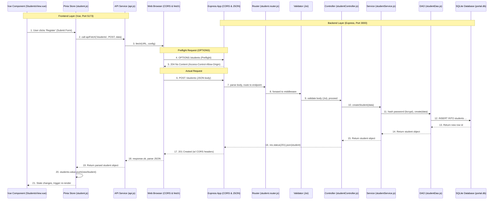

# Meet 8: Integration — Connecting the Frontend to the Backend

This session covers the integration of a Vue 3 frontend (built with Vite and Pinia) with an Express.js backend (using SQLite and Joi). 

## Running the Application

You need to run both the frontend and backend servers simultaneously.

**1. Start the Backend API:**
```bash
cd api
npm install
npm run dev
```

**2. Start the Frontend Web App:**
```bash
cd web
npm install
npm run dev
```

The frontend will be accessible at `http://localhost:5173`.

## End-to-End Data Flow


